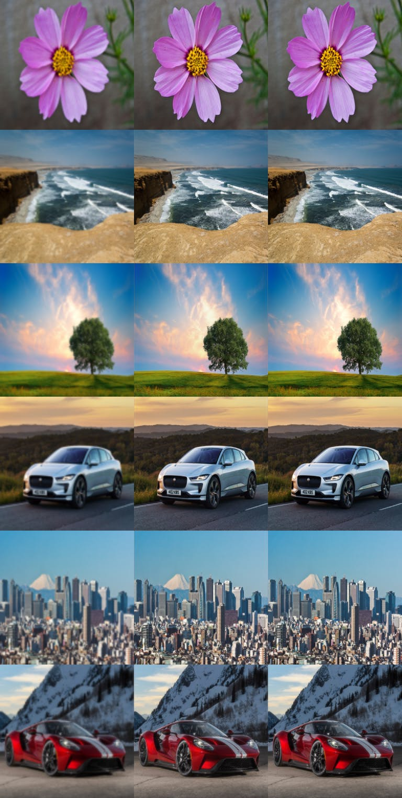

# Deep colorization

Implementation of deep learning model in Keras for superresolution. Work is still in progress.

---

### Examples

Input image (left), predicted image (center), ground truth (right)



---

### Requirements

- Python 3.x
- pip

### Installation and setup

Install pip packages using
```
$ pip install -r requirements.txt
```

Add `.env` file to project root with environmental variables
```
COMET_PROJECTNAME={comet_project_name}
COMET_WORKSPACE={comet_workspace}
COMET_API_KEY={comet_api_key}
```

[optional]

There is a Docker image included that was used for training in cloud. You can build it from local Dockerfile with
```
docker build -t ml-box .
```
or get it from Docker Hub
```
docker pull tomikeska/ml-box
```

### Usage

Train model using command
```
$ python src/train.py
```

### License

Code is released under the MIT License. Please see the LICENSE file for details.
